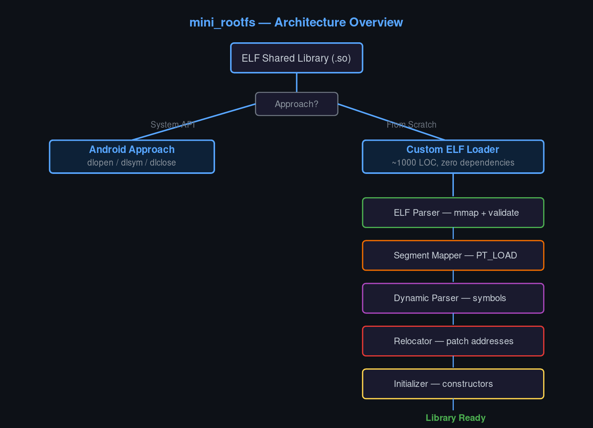
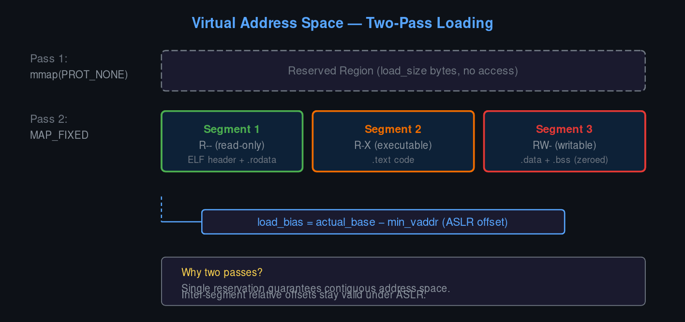
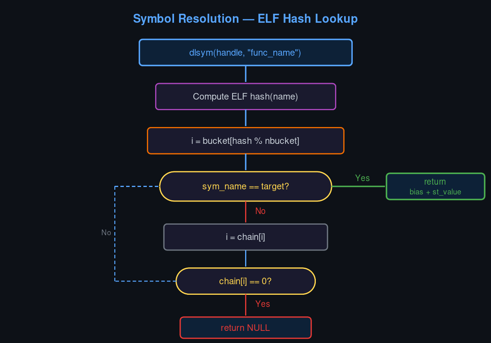

<div align="center">


</div>

**[中文](README.md)** | English

# Mini Rootfs — Building a Custom Dynamic Linking Environment

This project demonstrates how to build a minimal rootfs (root filesystem) with dynamic library loading. Two implementations are provided:

1. **Android approach**: uses the system `dlopen/dlsym` API
2. **Linux approach**: a from-scratch ELF loader modeled after the Android linker

```
                         ┌─────────────────────────┐
                         │   ELF Shared Library     │
                         │        (.so file)        │
                         └────────────┬────────────┘
                                      │
                        ┌─────────────┴─────────────┐
                        ▼                           ▼
              ┌──────────────────┐       ┌──────────────────────┐
              │  Android Approach│       │  Custom ELF Loader   │
              │  (System API)    │       │  (~1000 LOC, zero    │
              │  dlopen/dlsym   │       │   dependencies)      │
              │  dlclose         │       └──────────┬───────────┘
              └──────────────────┘                  │
                                          ┌────────┴────────┐
                                          ▼                 │
                                   ① ELF Parser             │
                                     mmap + validate        │
                                          │                 │
                                          ▼                 │
                                   ② Segment Mapper         │
                                     PT_LOAD → mmap         │
                                     MAP_FIXED              │
                                          │                 │
                                          ▼                 │
                                   ③ Dynamic Parser         │
                                     PT_DYNAMIC →           │
                                     symbol tables          │
                                          │                 │
                                          ▼                 │
                                   ④ Relocator              │
                                     R_X86_64_* →           │
                                     patch addresses        │
                                          │                 │
                                          ▼                 │
                                   ⑤ Initializer            │
                                     DT_INIT →              │
                                     DT_INIT_ARRAY          │
                                          │                 │
                                          ▼                 │
                                   ✓ Library Ready          │
                                     mini_dlsym callable    │
                                                            │
```

<div align="center">

</div>

---

## Table of Contents

- [1. Core Concepts](#1-core-concepts)
  - [1.1 What Is a Rootfs](#11-what-is-a-rootfs)
  - [1.2 The ELF File Format](#12-the-elf-file-format)
  - [1.3 How Dynamic Linking Works](#13-how-dynamic-linking-works)
- [2. Project Structure](#2-project-structure)
- [3. Android Approach: System dlopen](#3-android-approach-system-dlopen)
  - [3.1 Creating a Shared Library](#31-creating-a-shared-library)
  - [3.2 Loading Libraries at Runtime](#32-loading-libraries-at-runtime)
  - [3.3 Building and Running](#33-building-and-running)
- [4. Linux Approach: Custom ELF Loader](#4-linux-approach-custom-elf-loader)
  - [4.1 ELF Parser](#41-elf-parser)
  - [4.2 Linker Core](#42-linker-core)
  - [4.3 Symbol Lookup and Relocation](#43-symbol-lookup-and-relocation)
  - [4.4 Implementing dlopen/dlsym](#44-implementing-dlopendlsym)
- [5. Build System](#5-build-system)
- [6. Runtime Demos](#6-runtime-demos)

---

## 1. Core Concepts

### 1.1 What Is a Rootfs

A rootfs (Root Filesystem) is the base filesystem of an operating system, containing the files needed to boot and run:

```
rootfs/
├── bin/           # Executables
├── lib/           # Shared libraries (.so files)
├── etc/           # Configuration files
└── ...
```

In embedded systems and container environments, building a minimal rootfs is a common requirement. This project focuses on one core piece: **dynamic library loading**.

> **Design Rationale:** We target a minimal rootfs rather than a full OS image because the goal is to understand the linker, not the kernel. Stripping away everything except the dynamic loading pipeline isolates the mechanism and makes each step auditable in a debugger.

### 1.2 The ELF File Format

ELF (Executable and Linkable Format) is the standard executable format on Linux and Android.

#### ELF File Layout

```
+-------------------+
|    ELF Header     |  <- File header: file type, architecture, etc.
+-------------------+
| Program Headers   |  <- How to load segments into memory
+-------------------+
|                   |
|    Sections       |  <- .text, .data, .rodata, etc.
|                   |
+-------------------+
| Section Headers   |  <- Section attributes and metadata
+-------------------+
```

#### Key Program Header Types

| Type | Description |
|------|-------------|
| `PT_LOAD` | Loadable segment — must be mapped into memory |
| `PT_DYNAMIC` | Dynamic linking information |
| `PT_INTERP` | Interpreter path (e.g. `/lib/ld-linux.so`) |
| `PT_GNU_RELRO` | Read-only after relocation |

#### Inspecting ELF Files

```bash
# ELF header
readelf -h libdemo.so

# Program headers
readelf -l libdemo.so

# Section headers
readelf -S libdemo.so

# Dynamic segment
readelf -d libdemo.so

# Symbol table
nm -D libdemo.so
```

### 1.3 How Dynamic Linking Works

Dynamic linking defers library loading to runtime instead of embedding everything at compile time.

> **Design Rationale:** Static linking bloats every binary with duplicate library copies and makes patching impossible without relinking. Dynamic linking trades a one-time load cost for shared memory, smaller binaries, and hot-swappable libraries — the same tradeoff the Android linker optimizes for on memory-constrained devices.

#### The Linking Pipeline

```
1. Open the ELF file
       ↓
2. Parse ELF header and program headers
       ↓
3. Map PT_LOAD segments into memory
       ↓
4. Parse the dynamic segment (PT_DYNAMIC)
       ↓
5. Perform relocations (patch address references)
       ↓
6. Call initialization functions (constructors)
       ↓
7. Library is ready — exported functions are callable
```

---

## 2. Project Structure

```
mini_rootfs/
├── Makefile                    # Top-level build script (unified entry point)
├── README.md                   # This document
│
├── android/                    # Android approach
│   ├── Makefile               # Build script (native / cross-compile)
│   └── src/
│       ├── main.c             # Main program (system dlopen)
│       ├── demo.c             # Sample shared library 1
│       └── demo2.c            # Sample shared library 2
│
├── linux/                      # Linux approach (custom linker)
│   ├── Makefile               # Build script
│   ├── lib/
│   │   ├── elf.h              # ELF format definitions
│   │   ├── elf_parser.h       # ELF parser header
│   │   ├── linker.h           # Linker header
│   │   ├── mini_dlfcn.h       # Custom dlopen API
│   │   └── log.h              # Logging
│   ├── src/
│   │   ├── elf_parser.c       # ELF file parsing
│   │   ├── linker.c           # Core linker implementation
│   │   ├── dlfcn.c            # dlopen/dlsym implementation
│   │   └── log.c              # Logging implementation
│   └── test/
│       ├── main.c             # Test harness
│       └── test_lib.c         # Test shared library
│
├── demo/                       # Socket communication demo
│   ├── Makefile               # Build script
│   └── src/
│       ├── server.c           # TCP server
│       ├── client.c           # TCP client
│       └── protocol.h         # Custom binary protocol
│
└── docs/                       # Documentation
```

### Quick Start

```bash
# Build from the project root
make help             # List available targets
make linux            # Build the Linux custom linker
make android          # Build the Android loader (native)
make android-cross    # Cross-compile for Android devices
make demo             # Build the socket demo
make clean            # Clean all build artifacts
```

---

## 3. Android Approach: System dlopen

This approach uses the system's dynamic linking API — straightforward and minimal.

### 3.1 Creating a Shared Library

Shared libraries export functions for external callers.

**demo.c** — sample shared library:

```c
#include <stdio.h>

/* Exported: print a greeting */
void demo_hello(void) {
    printf("[demo.so] Hello from demo shared library!\n");
}

/* Exported: addition */
int demo_add(int a, int b) {
    printf("[demo.so] Calculating %d + %d\n", a, b);
    return a + b;
}

/* Exported: version string */
const char* demo_version(void) {
    return "Demo Library v1.0";
}

/* Called automatically when the library is loaded */
__attribute__((constructor))
void demo_init(void) {
    printf("[demo.so] Library loaded! (constructor called)\n");
}

/* Called automatically when the library is unloaded */
__attribute__((destructor))
void demo_fini(void) {
    printf("[demo.so] Library unloading! (destructor called)\n");
}
```

#### Key Points

1. **`__attribute__((constructor))`** marks a function to run automatically at load time
2. **`__attribute__((destructor))`** marks a function to run automatically at unload time
3. **Exported functions**: non-`static` functions are exported by default

### 3.2 Loading Libraries at Runtime

**main.c** — loading a library with dlopen:

```c
#include <stdio.h>
#include <stdlib.h>
#include <dlfcn.h>      // dlopen, dlsym, dlclose, dlerror

/* Function pointer typedefs */
typedef void (*func_void)(void);
typedef int (*func_int_int_int)(int, int);
typedef const char* (*func_str_void)(void);

int main(int argc, char *argv[]) {
    /* 1. Open the shared library */
    void *handle = dlopen("./lib/libdemo.so", RTLD_NOW);
    if (!handle) {
        fprintf(stderr, "dlopen failed: %s\n", dlerror());
        return 1;
    }

    /* 2. Look up symbols (function addresses) */
    // Clear any previous error
    dlerror();

    // Get demo_hello
    func_void hello = (func_void)dlsym(handle, "demo_hello");
    char *error = dlerror();
    if (error != NULL) {
        fprintf(stderr, "dlsym failed: %s\n", error);
        dlclose(handle);
        return 1;
    }

    // Get demo_add
    func_int_int_int add = (func_int_int_int)dlsym(handle, "demo_add");

    // Get demo_version
    func_str_void version = (func_str_void)dlsym(handle, "demo_version");

    /* 3. Call the functions */
    hello();                          // Call demo_hello
    int result = add(10, 20);         // Call demo_add
    printf("Result: %d\n", result);
    printf("Version: %s\n", version()); // Call demo_version

    /* 4. Close the library */
    dlclose(handle);

    return 0;
}
```

#### dlopen Reference

```c
void *dlopen(const char *filename, int flags);
```

| Parameter | Description |
|-----------|-------------|
| `filename` | Path to the library |
| `flags` | Loading flags |

Common flags:

| Flag | Description |
|------|-------------|
| `RTLD_NOW` | Resolve all symbols immediately |
| `RTLD_LAZY` | Defer symbol resolution until first call |
| `RTLD_GLOBAL` | Make symbols available to other libraries |
| `RTLD_LOCAL` | Keep symbols private to this library |

#### dlsym Reference

```c
void *dlsym(void *handle, const char *symbol);
```

| Parameter | Description |
|-----------|-------------|
| `handle` | Handle from dlopen, or a special value |
| `symbol` | Symbol name (function or variable) |

Special handle values:

| Value | Description |
|-------|-------------|
| `RTLD_DEFAULT` | Search all loaded libraries |
| `RTLD_NEXT` | Search libraries loaded after the caller |

### 3.3 Building and Running

**Makefile highlights**:

```makefile
# Compiler config
CC = gcc
CFLAGS = -Wall -fPIC      # -fPIC: position-independent code (required for .so)
LDFLAGS = -ldl            # Link libdl (provides dlopen et al.)

# Build the shared library
lib/libdemo.so: src/demo.c
	$(CC) $(CFLAGS) -shared -o $@ $<
	# -shared: produce a shared object
	# $@: target (lib/libdemo.so)
	# $<: first prerequisite (src/demo.c)

# Build the main program
loader: src/main.c
	$(CC) $(CFLAGS) -o $@ $< $(LDFLAGS)
```

**Example run**:

```bash
cd android
make native    # Build
make run       # Run

# Output:
# [demo.so] Library loaded! (constructor called)
# [demo.so] Hello from demo shared library!
# [demo.so] Calculating 10 + 20
# Result: 30
# Version: Demo Library v1.0
# [demo.so] Library unloading! (destructor called)
```

---

## 4. Linux Approach: Custom ELF Loader

This approach builds an ELF loader from scratch, exposing the full dynamic linking pipeline.

> **Design Rationale:** Building the loader from scratch instead of wrapping `ld-linux.so` forces us to handle every detail the system linker hides: segment alignment, load bias computation, BSS zeroing. This is the same path the Android team took when they needed a linker that could run in Bionic's constrained environment without glibc.

### 4.1 ELF Parser

**elf_parser.h** — ELF file structure:

```c
#include <elf.h>    // System ELF header — defines Elf64_Ehdr, etc.

/* ELF file handle */
typedef struct {
    int fd;                  // File descriptor
    void* map_start;         // mmap base address
    size_t map_size;         // Mapping size
    Elf64_Ehdr* ehdr;        // ELF header
    Elf64_Phdr* phdr;        // Program header table
    Elf64_Shdr* shdr;        // Section header table
    const char* shstrtab;    // Section name string table
} elf_file_t;
```

**elf_parser.c** — parsing an ELF file:

```c
#include <sys/mman.h>
#include <sys/stat.h>
#include <fcntl.h>

/* Validate the ELF header */
int elf_validate_header(const Elf64_Ehdr* ehdr) {
    /* Check the ELF magic: 0x7F 'E' 'L' 'F' */
    if (ehdr->e_ident[EI_MAG0] != ELFMAG0 ||    // 0x7F
        ehdr->e_ident[EI_MAG1] != ELFMAG1 ||    // 'E'
        ehdr->e_ident[EI_MAG2] != ELFMAG2 ||    // 'L'
        ehdr->e_ident[EI_MAG3] != ELFMAG3) {    // 'F'
        return -1;  // Not an ELF file
    }

    /* Must be 64-bit */
    if (ehdr->e_ident[EI_CLASS] != ELFCLASS64) {
        return -1;
    }

    /* Must be a shared object or executable */
    if (ehdr->e_type != ET_DYN && ehdr->e_type != ET_EXEC) {
        return -1;
    }

    return 0;
}

/* Open and mmap an ELF file */
int elf_open(const char* path, elf_file_t* elf) {
    struct stat st;

    /* Open the file */
    elf->fd = open(path, O_RDONLY);
    if (elf->fd < 0) return -1;

    /* Get the file size */
    fstat(elf->fd, &st);
    elf->map_size = st.st_size;

    /* mmap the entire file into memory */
    elf->map_start = mmap(NULL, elf->map_size,
                          PROT_READ, MAP_PRIVATE,
                          elf->fd, 0);
    if (elf->map_start == MAP_FAILED) return -1;

    /* Parse the ELF header (starts at offset 0) */
    elf->ehdr = (Elf64_Ehdr*)elf->map_start;
    if (elf_validate_header(elf->ehdr) < 0) return -1;

    /* Locate the program header table */
    elf->phdr = (Elf64_Phdr*)((uint8_t*)elf->map_start + elf->ehdr->e_phoff);

    /* Locate the section header table */
    elf->shdr = (Elf64_Shdr*)((uint8_t*)elf->map_start + elf->ehdr->e_shoff);

    return 0;
}
```

> **Design Rationale:** We `mmap` the entire file read-only rather than using `read()` because the ELF header, program headers, and section headers are scattered across the file. A single mapping gives O(1) random access to any offset — the same approach used by `readelf` and the kernel's own ELF loader.

### 4.2 Linker Core

**linker.h** — the soinfo struct (modeled after Android's linker):

> **Design Rationale:** The `soinfo` struct mirrors Android's linker data structure intentionally. Anyone who later reads AOSP's `linker.cpp` will recognize the same fields (`load_bias`, `dynamic`, `init_array`). This makes the project a stepping stone to real linker hacking, not just an academic exercise.

```c
/* Loaded library descriptor (mirrors Android's soinfo) */
typedef struct soinfo {
    char name[256];             // Library name

    /* Load info */
    void* base;                 // Load base address
    size_t size;                // Total mapped size
    void* load_bias;            // Load bias (actual addr - expected addr)

    /* ELF structures */
    Elf64_Phdr* phdr;           // Program header table
    size_t phnum;               // Program header count
    Elf64_Dyn* dynamic;         // Dynamic segment

    /* Symbol table */
    Elf64_Sym* symtab;          // Symbol table
    const char* strtab;         // String table

    /* Hash tables (for fast symbol lookup) */
    uint32_t* hash;             // ELF hash
    uint32_t* gnu_hash;         // GNU hash

    /* Relocation tables */
    Elf64_Rela* rela;           // RELA relocations
    size_t rela_count;
    Elf64_Rela* plt_rela;       // PLT relocations
    size_t plt_rela_count;

    /* Init / fini */
    void (*init_func)(void);    // DT_INIT
    void (*fini_func)(void);    // DT_FINI
    void (**init_array)(void);  // DT_INIT_ARRAY
    size_t init_array_count;
    void (**fini_array)(void);  // DT_FINI_ARRAY
    size_t fini_array_count;

    struct soinfo* next;        // Linked list
} soinfo_t;
```

```
  Virtual Address Space — Two-Pass Loading
  ═════════════════════════════════════════

  Pass 1: mmap(PROT_NONE, load_size)
  ┌──────────────────────────────────────────────────────────┐
  │            Reserved Region (no access)                   │
  │                                                          │
  └──────────────────────────────────────────────────────────┘

  Pass 2: mmap(MAP_FIXED) per PT_LOAD
  ┌──────────────────┬───────────────────┬───────────────────┐
  │   Segment 1      │   Segment 2       │   Segment 3       │
  │   R-- (readonly) │   R-X (execute)   │   RW- (writable)  │
  │                  │                   │                   │
  │   ELF header     │   .text code      │   .data + .bss    │
  │   .rodata        │                   │   (bss zeroed)    │
  └──────────────────┴───────────────────┴───────────────────┘
        ▲
        │
  load_bias = actual_base − min_vaddr  (ASLR offset)

  Why two passes?
  • Single reservation guarantees contiguous address space.
  • Inter-segment relative offsets stay valid under ASLR.
  • Same strategy used by Linux kernel's load_elf_binary()
    and Android's linker.
```

<div align="center">

</div>

**linker.c** — loading a shared library:

> **Design Rationale:** The two-pass loading strategy — first `mmap(PROT_NONE)` to reserve the full address range, then `MAP_FIXED` each PT_LOAD segment — prevents fragmentation and guarantees that inter-segment references (which use relative offsets) remain valid. This is how both the Linux kernel's `load_elf_binary()` and Android's linker handle ASLR-compatible loading.

```c
#include <sys/mman.h>

#define PAGE_SIZE 4096
#define PAGE_START(x) ((x) & ~(PAGE_SIZE - 1))
#define PAGE_END(x)   PAGE_START((x) + PAGE_SIZE - 1)

/* Load a shared library */
soinfo_t* linker_load(const char* path) {
    elf_file_t elf;
    soinfo_t* si;

    /* 1. Open the ELF file */
    if (elf_open(path, &elf) < 0) return NULL;

    /* 2. Allocate soinfo */
    si = calloc(1, sizeof(soinfo_t));
    strncpy(si->name, path, sizeof(si->name) - 1);

    /* 3. Calculate total memory needed */
    size_t load_size = calculate_load_size(elf.phdr, elf.ehdr->e_phnum);

    /* 4. Reserve address space */
    si->base = mmap(NULL, load_size, PROT_NONE,
                    MAP_PRIVATE | MAP_ANONYMOUS, -1, 0);
    if (si->base == MAP_FAILED) goto error;

    /* 5. Compute load bias */
    Elf64_Addr min_vaddr = find_min_vaddr(elf.phdr, elf.ehdr->e_phnum);
    si->load_bias = (void*)((uint8_t*)si->base - min_vaddr);

    /* 6. Map each PT_LOAD segment */
    int fd = open(path, O_RDONLY);
    for (size_t i = 0; i < elf.ehdr->e_phnum; i++) {
        Elf64_Phdr* phdr = &elf.phdr[i];
        if (phdr->p_type != PT_LOAD) continue;

        /* Compute mapping address and offset */
        Elf64_Addr seg_start = (Elf64_Addr)si->load_bias + phdr->p_vaddr;
        Elf64_Addr seg_page_start = PAGE_START(seg_start);

        /* Map the file content */
        mmap((void*)seg_page_start,
             phdr->p_filesz + (seg_start - seg_page_start),
             elf_to_mmap_prot(phdr->p_flags),  // Convert ELF flags to mmap prot
             MAP_PRIVATE | MAP_FIXED,
             fd, PAGE_START(phdr->p_offset));

        /* Handle BSS (p_memsz > p_filesz) */
        if (phdr->p_memsz > phdr->p_filesz) {
            /* Zero-fill the BSS region */
            memset((void*)(seg_start + phdr->p_filesz), 0,
                   phdr->p_memsz - phdr->p_filesz);
        }
    }
    close(fd);

    /* 7. Parse the dynamic segment */
    parse_dynamic(si);

    /* 8. Perform relocations */
    linker_relocate(si);

    elf_close(&elf);
    return si;

error:
    free(si);
    elf_close(&elf);
    return NULL;
}
```

### 4.3 Symbol Lookup and Relocation

> **Design Rationale:** ELF hash gives O(1) amortized symbol lookup instead of scanning the entire symbol table linearly. For a library with 500+ exports, this is the difference between microseconds and milliseconds per `dlsym` call. We implement both ELF hash and GNU hash because real-world `.so` files use either or both.

**Symbol lookup** — using ELF hash or GNU hash:

```c
/* ELF hash function */
static uint32_t elf_hash(const char* name) {
    uint32_t h = 0, g;
    const unsigned char* s = (const unsigned char*)name;
    while (*s) {
        h = (h << 4) + *s++;
        if ((g = h & 0xf0000000) != 0) {
            h ^= g >> 24;
        }
        h &= ~g;
    }
    return h;
}

/* Look up a symbol via ELF hash */
void* linker_find_symbol(soinfo_t* si, const char* name) {
    if (!si->hash || !si->symtab || !si->strtab) return NULL;

    uint32_t nbucket = si->hash[0];  // Number of buckets
    uint32_t* bucket = &si->hash[2]; // Bucket array
    uint32_t* chain = &si->hash[2 + nbucket]; // Chain array

    uint32_t hash = elf_hash(name);

    /* Walk the hash chain */
    for (uint32_t i = bucket[hash % nbucket]; i != 0; i = chain[i]) {
        Elf64_Sym* sym = &si->symtab[i];
        const char* sym_name = si->strtab + sym->st_name;

        if (strcmp(sym_name, name) == 0 && sym->st_shndx != SHN_UNDEF) {
            /* Found — return the resolved address */
            return (uint8_t*)si->load_bias + sym->st_value;
        }
    }
    return NULL;
}
```

**Relocation processing** — patching address references:

```c
/* Process a single relocation entry */
static int do_reloc(soinfo_t* si, Elf64_Rela* rela) {
    uint32_t type = ELF64_R_TYPE(rela->r_info);    // Relocation type
    uint32_t sym_idx = ELF64_R_SYM(rela->r_info);  // Symbol index

    /* Target address to patch */
    void* reloc_addr = (uint8_t*)si->load_bias + rela->r_offset;

    /* Resolve the symbol address */
    void* sym_addr = NULL;
    if (sym_idx != 0) {
        Elf64_Sym* sym = &si->symtab[sym_idx];
        const char* sym_name = si->strtab + sym->st_name;
        sym_addr = linker_find_global_symbol(sym_name);
    }

    /* Apply relocation by type */
    switch (type) {
        case R_X86_64_NONE:
            /* No-op */
            break;

        case R_X86_64_64:
            /* Absolute address: S + A */
            *(uint64_t*)reloc_addr = (uint64_t)sym_addr + rela->r_addend;
            break;

        case R_X86_64_GLOB_DAT:
        case R_X86_64_JUMP_SLOT:
            /* GOT/PLT entry: S */
            *(uint64_t*)reloc_addr = (uint64_t)sym_addr;
            break;

        case R_X86_64_RELATIVE:
            /* Relative address: B + A (B = load_bias) */
            *(uint64_t*)reloc_addr = (uint64_t)si->load_bias + rela->r_addend;
            break;
    }
    return 0;
}

/* Apply all relocations */
int linker_relocate(soinfo_t* si) {
    /* Process RELA relocations */
    for (size_t i = 0; i < si->rela_count; i++) {
        do_reloc(si, &si->rela[i]);
    }

    /* Process PLT relocations */
    for (size_t i = 0; i < si->plt_rela_count; i++) {
        do_reloc(si, &si->plt_rela[i]);
    }

    return 0;
}
```

Common relocation types (x86_64):

| Type | Formula | Description |
|------|---------|-------------|
| `R_X86_64_64` | S + A | Absolute 64-bit address |
| `R_X86_64_GLOB_DAT` | S | GOT entry |
| `R_X86_64_JUMP_SLOT` | S | PLT entry |
| `R_X86_64_RELATIVE` | B + A | Relative to load base |

Where: S = symbol address, A = addend, B = load_bias

```
  Symbol Resolution — ELF Hash Lookup
  ════════════════════════════════════

  dlsym(handle, "func_name")
          │
          ▼
  ┌─────────────────────────┐
  │ Compute ELF hash(name)  │
  └────────────┬────────────┘
               │
               ▼
  ┌─────────────────────────┐
  │ i = bucket[hash%nbucket]│
  └────────────┬────────────┘
               │
               ▼
       ┌───────────────┐    Yes   ┌──────────────────┐
       │ sym_name ==   │────────▶│ return             │
       │   target?     │         │ load_bias+st_value │
       └───────┬───────┘         └──────────────────┘
               │ No
               ▼
       ┌───────────────┐
       │ i = chain[i]  │
       └───────┬───────┘
               │
               ▼
       ┌───────────────┐    Yes   ┌──────────────────┐
       │ chain[i]==0 ? │────────▶│ return NULL        │
       └───────┬───────┘         │ (not found)        │
               │ No              └──────────────────┘
               │
               └──── loop back to "sym_name == target?"
```

<div align="center">

</div>

### 4.4 Implementing dlopen/dlsym

> **Design Rationale:** Wrapping the linker internals behind the standard `dlopen/dlsym/dlclose/dlerror` API means user code doesn't need to change — swap `#include <dlfcn.h>` for `#include "mini_dlfcn.h"` and the same program works with our custom linker. This API contract also makes the project directly comparable to the Android approach in Section 3.

**dlfcn.c** — the dlopen API wrapper:

```c
#include "linker.h"

/* mini_dlopen — load a shared library */
void* mini_dlopen(const char* path, int flags) {
    (void)flags;  // Flags ignored for now

    /* Load the library */
    soinfo_t* si = linker_load(path);
    if (!si) return NULL;

    /* Call constructors */
    linker_call_constructors(si);

    return (void*)si;
}

/* mini_dlsym — look up a symbol */
void* mini_dlsym(void* handle, const char* symbol) {
    if (handle == MINI_RTLD_DEFAULT) {
        /* Search all loaded libraries */
        return linker_find_global_symbol(symbol);
    }

    /* Search the specified library */
    soinfo_t* si = (soinfo_t*)handle;
    return linker_find_symbol(si, symbol);
}

/* mini_dlclose — unload a library */
int mini_dlclose(void* handle) {
    soinfo_t* si = (soinfo_t*)handle;
    linker_unload(si);  // Call destructors, free resources
    return 0;
}

/* mini_dlerror — get the last error message */
const char* mini_dlerror(void) {
    return linker_get_error();
}
```

**Constructor / destructor invocation**:

```c
/* Call constructors */
void linker_call_constructors(soinfo_t* si) {
    /* 1. Call DT_INIT */
    if (si->init_func) {
        si->init_func();
    }

    /* 2. Call DT_INIT_ARRAY */
    if (si->init_array) {
        for (size_t i = 0; i < si->init_array_count; i++) {
            if (si->init_array[i]) {
                si->init_array[i]();
            }
        }
    }
}

/* Call destructors */
void linker_call_destructors(soinfo_t* si) {
    /* 1. Call DT_FINI_ARRAY (reverse order) */
    if (si->fini_array) {
        for (size_t i = si->fini_array_count; i > 0; i--) {
            if (si->fini_array[i-1]) {
                si->fini_array[i-1]();
            }
        }
    }

    /* 2. Call DT_FINI */
    if (si->fini_func) {
        si->fini_func();
    }
}
```

> **Design Rationale:** Constructors run in `DT_INIT` → `DT_INIT_ARRAY` order, but destructors run in reverse (`DT_FINI_ARRAY` reversed → `DT_FINI`). This LIFO ordering ensures that a library's dependencies are still alive when its destructor runs — the same invariant the C++ runtime relies on for static object destruction.

---

## 5. Build System

### Android Build

```bash
cd android
make native       # Build natively
make run          # Run the test
make clean        # Clean

# Cross-compile for Android
export NDK_PATH=/path/to/ndk
make android ANDROID_ABI=arm64-v8a
```

### Linux Build

```bash
cd linux
make              # Build
make run          # Run the test
make readelf      # Inspect the test library's ELF headers
make nm           # List symbols
make clean        # Clean
```

---

## 6. Runtime Demos

### Android Approach Output

```
$ cd android && make run

==========================================
Android rootfs - Dynamic Library Loader
==========================================

Loading 2 libraries...

=== Loading library: ./lib/libdemo.so ===
[demo.so] Library loaded! (constructor called)
Successfully loaded: ./lib/libdemo.so

=== Loading library: ./lib/libdemo2.so ===
[demo2.so] Library loaded! (constructor called)
Successfully loaded: ./lib/libdemo2.so

--- Testing demo.so functions ---
Found function: demo_hello at 0x...
[demo.so] Hello from demo shared library!
Result: 10 + 20 = 30
Version: Demo Library v1.0

--- Testing demo2.so functions ---
[demo2.so] Message: Hello from main program!
Result: 6 * 7 = 42

=== Unloading libraries ===
[demo2.so] Library unloading! (destructor called)
[demo.so] Library unloading! (destructor called)

Program completed successfully!
```

### Custom Linker Output

```
$ cd linux && make run

===========================================
  Mini Linker - Android-style ELF Loader
===========================================

--- Analyzing ELF file ---
=== ELF Header ===
Type: Shared Object
Entry: 0x0
Program headers: 9
Section headers: 22

=== Program Headers ===
[ 0] PHDR         offset=0x00000040 vaddr=0x00000040 ...
[ 1] LOAD         offset=0x00000000 vaddr=0x00000000 ... flags=R--
[ 2] LOAD         offset=0x00001000 vaddr=0x00001000 ... flags=R-X
[ 3] LOAD         offset=0x00002000 vaddr=0x00002000 ... flags=RW-
[ 4] DYNAMIC      offset=0x00002e00 vaddr=0x00002e00 ...

--- Loading library ---
[linker] Loading: lib/test_lib.so
[linker] Base address: 0x7f..., load_bias: 0x7f...
[linker] Loaded segment: vaddr=0x0, memsz=0x470, flags=R--
[linker] Loaded segment: vaddr=0x1000, memsz=0x1c5, flags=R-X
[linker] Calling DT_INIT_ARRAY for lib/test_lib.so
[test_lib] Constructor called (count=1)

--- Testing functions ---
add(10, 20) = 30
multiply(6, 7) = 42
get_message() = "Hello from mini linker!"
[test_lib] Hello, Mini Linker!
factorial(5) = 120

--- Unloading library ---
[linker] Calling DT_FINI_ARRAY for lib/test_lib.so
[test_lib] Destructor called

===========================================
  Test completed successfully!
===========================================
```

---

## Use Cases in Reverse Engineering & Security

This project isn't just educational — the techniques map directly to real-world RE and security scenarios:

### Hooking & Instrumentation
- **LD_PRELOAD-style interception**: Replace the custom linker's symbol resolution to redirect function calls at load time — the same mechanism behind tools like `libhook` and Frida's early-init mode.
- **GOT/PLT hijacking**: Understanding relocation types (`R_X86_64_JUMP_SLOT`, `R_X86_64_GLOB_DAT`) is essential for building inline hooks that patch the GOT to redirect API calls.

### Binary Analysis
- **Unpacking obfuscated SO files**: Commercial packers (Bangcle, Ijiami, Tencent Legu) encrypt `.text` segments and decrypt at load time. Understanding the PT_LOAD mapping pipeline lets you dump the decrypted segments at the right moment.
- **Anti-debugging bypass**: Some protections hook `dlopen` to detect instrumentation. A custom linker sidesteps the entire detection surface.

### Sandbox & Emulation
- **unidbg / Unicorn integration**: When emulating Android native code, you need to replicate the linker's behavior — segment mapping, relocation, constructor calls. This project's `linker_load()` is a minimal reference implementation.
- **Rootless analysis environments**: Combined with `sidecar` (user-namespace chroot), this linker can load and execute `.so` files in isolated environments without root — useful for malware analysis and fuzzing.

### DRM & Content Protection Research
- **CDM library loading**: Understanding how Chrome loads `libwidevinecdm.so` (via `dlopen` with custom symbol resolution) requires exactly the knowledge this project teaches.
- **Custom loader for instrumented libraries**: Rebuild a target `.so` with modified relocations to intercept DRM key exchange functions.

### CTF & Exploit Development
- **Return-to-PLT / ret2dlresolve**: These exploit techniques manipulate the dynamic linker's relocation structures. Hands-on experience with `do_reloc()` makes these attacks intuitive rather than magical.
- **RELRO bypass**: Understanding `PT_GNU_RELRO` and when relocations are finalized is critical for exploits that target the GOT after partial RELRO.

---

## Summary

| Feature | Android Approach | Custom Linker |
|---------|-----------------|---------------|
| Complexity | Low (system API) | High (full implementation) |
| Lines of code | ~200 | ~1000 |
| Use case | Rapid development | Learning internals, special requirements |
| Dependencies | System libdl | None |
| Customizability | Low | High |

By working through this project you'll gain hands-on understanding of:
- The ELF file format
- How dynamic linking works under the hood
- Symbol lookup and relocation mechanics
- Constructor/destructor invocation order

This knowledge applies directly to understanding the Android linker, reverse engineering shared libraries, and building tools like LD_PRELOAD interceptors.
