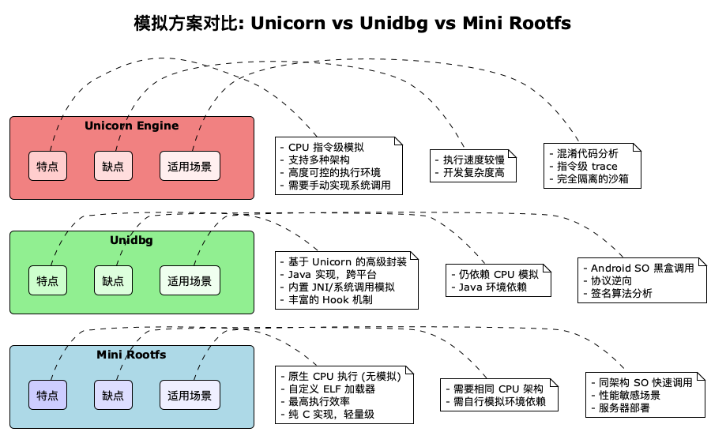
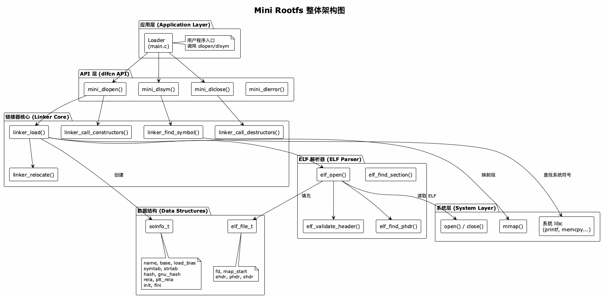
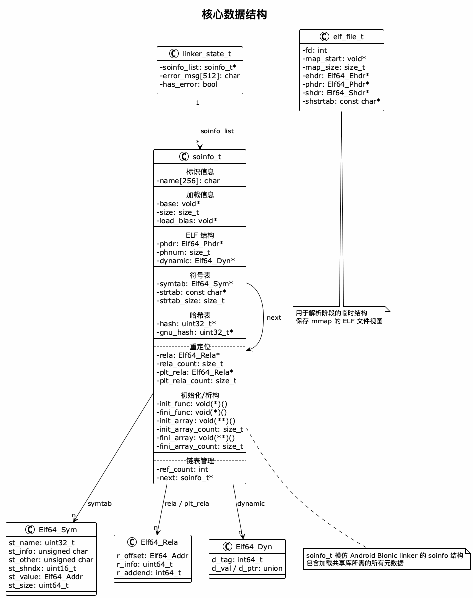
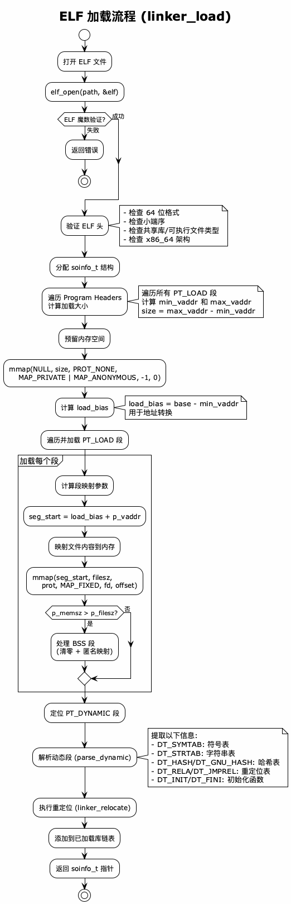
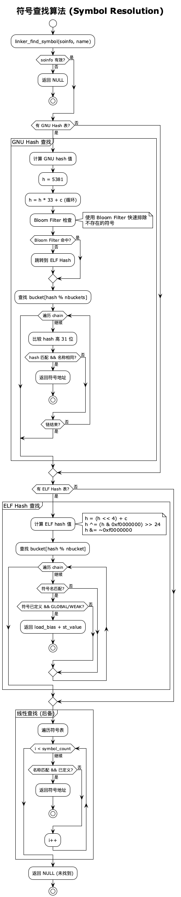
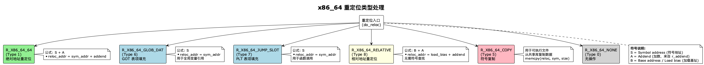
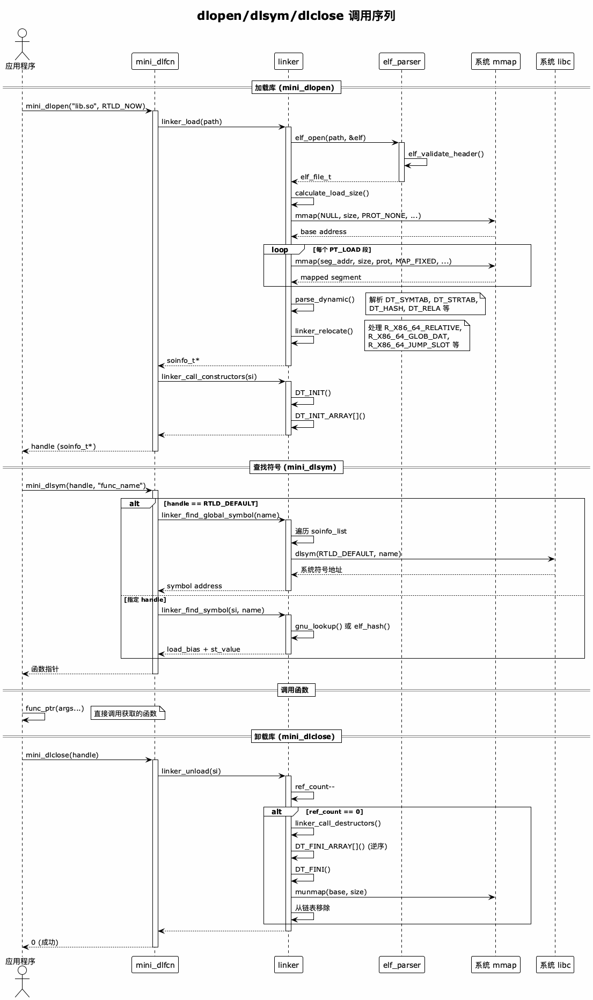
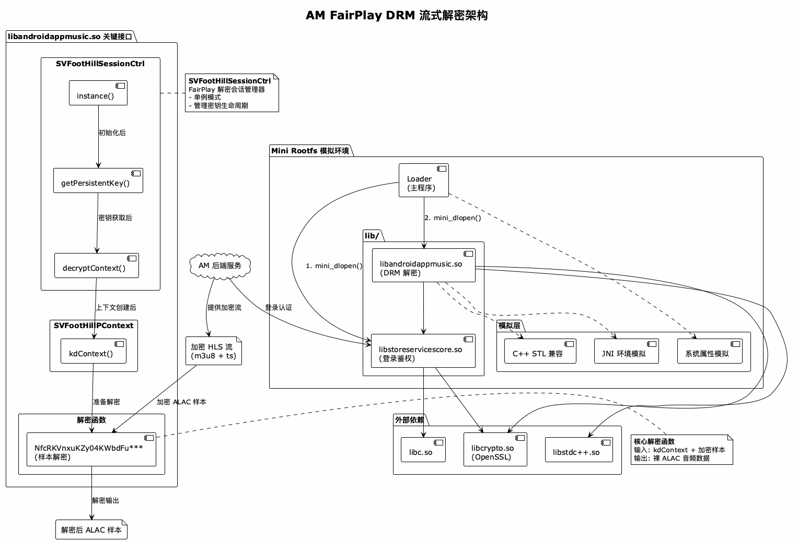

# Mini Rootfs 实现指南：从 Unidbg 到原生 ELF 加载器

> 本文从我（作者）的视角讲解如何构建一个轻量级的 ELF 动态链接器，对比 QEMU、Unicorn 和 Unidbg 的实现思路，最终引出在服务器端模拟调用 Apple Music FairPlay DRM 库的实践方案。

---

## 目录

1. [背景与动机](#1-背景与动机)
   - [1.1 问题的起源](#11-问题的起源)
   - [1.2 我的探索之路](#12-我的探索之路)
   - [1.3 为什么叫 "Rootfs"？](#13-为什么叫-rootfs)
2. [模拟器生态介绍](#2-模拟器生态介绍)
3. [方案对比](#3-方案对比)
4. [整体架构设计](#4-整体架构设计)
5. [核心实现详解](#5-核心实现详解)
6. [实战：AM FairPlay DRM 流式解密](#6-实战am-fairplay-drm-流式解密)
7. [总结与展望](#7-总结与展望)

---

## 1. 背景与动机

### 1.1 问题的起源

在逆向工程和安全研究领域，我们经常需要"黑盒调用"Android/Linux 的 `.so` 动态库——即在不了解其内部实现的情况下，直接调用其导出函数获取结果。

我遇到的典型场景包括：
- **协议逆向**：调用 App 的签名/加密函数，绕过混淆直接获取结果
- **DRM 分析**：解密受保护的媒体内容（比如 Apple Music 的 FairPlay）
- **安全研究**：在沙箱中安全地分析恶意软件行为

### 1.2 我的探索之路

最开始，我尝试过各种方案：直接在 Android 模拟器中运行、使用 Frida Hook、甚至考虑过反编译重写。但这些方案要么太重（需要完整的 Android 环境），要么太脆弱（反调试检测），要么工作量太大（逆向整个算法）。

直到我发现了 CPU 模拟器这条路——如果能在 PC 上直接"模拟"执行 ARM/Android 的代码，岂不是完美？这就引出了下面要介绍的 QEMU、Unicorn 和 Unidbg。

*插句题外话，提到模拟和虚拟化，就不得不膜拜一下 **Fabrice Bellard** 这位大神。他是 QEMU、FFmpeg 和 TinyCC 的作者。我们今天用到的 Unidbg，其底层核心 Unicorn Engine 正是脱胎于 QEMU。可以说，如果没有 Bellard 当年搞出的 QEMU，我们现在的跨架构模拟会困难得多。有了这些神级基础设施，我们才有可能去触碰像 **FairPlayDRM** 这样复杂的顶层机制（关于 FairPlay 后面我会专门开坑详聊），在二进制的世界里为所欲为。*

### 1.3 为什么叫 "Rootfs"？

项目名称 **Mini Rootfs** 中的 "rootfs" 借用自 Linux 容器技术的概念。在 Docker 和容器技术中，**rootfs (root filesystem)** 是容器运行的基础——它是一个精简的 Linux 文件系统，包含程序运行所需的最小依赖集。

```
┌─────────────────────────────────────────────────────────────────┐
│                    容器技术核心概念                               │
├─────────────────────────────────────────────────────────────────┤
│                                                                  │
│  ┌──────────────────┐                                           │
│  │    Namespace     │  进程隔离 (PID, Network, Mount, IPC...)    │
│  └────────┬─────────┘                                           │
│           ▼                                                      │
│  ┌──────────────────┐                                           │
│  │     Cgroups      │  资源限制 (CPU, Memory, I/O...)           │
│  └────────┬─────────┘                                           │
│           ▼                                                      │
│  ┌──────────────────┐                                           │
│  │     Rootfs       │  文件系统隔离 (/, /lib, /bin...)          │
│  └──────────────────┘                                           │
│                                                                  │
│  Docker = Namespace + Cgroups + Rootfs + 镜像分层                │
│                                                                  │
└─────────────────────────────────────────────────────────────────┘
```

Docker 的 rootfs 通常基于 Alpine、Ubuntu 等发行版的精简版本，通过 UnionFS/OverlayFS 实现镜像分层。每个容器看到的是一个独立的文件系统视图，与宿主机和其他容器隔离。

**我的 Mini Rootfs 借鉴了这个思路：**

| Docker Rootfs | Mini Rootfs |
|---------------|-------------|
| 完整的 Linux 文件系统 | 仅包含目标 SO 及其依赖 |
| 基于 Namespace 隔离 | 基于自定义 ELF 加载器隔离 |
| 需要 Linux 内核支持 | 纯用户态实现，跨平台 |
| 运行完整进程 | 只加载和调用特定函数 |

本质上，Mini Rootfs 是一个**极简化的用户态 rootfs**：我不需要完整的 Linux 环境，只需要能够加载目标 SO 库、解析符号、执行函数调用。这种设计使得它可以在 macOS、Linux 甚至 Windows (WSL) 上运行。

> 关于 Docker 底层技术的深入解析，强烈推荐阅读左耳朵耗子（陈皓）的系列文章：
> - [Docker 基础技术：Linux Namespace（上）](https://coolshell.cn/articles/17010.html)
> - [Docker 基础技术：Linux Namespace（下）](https://coolshell.cn/articles/17029.html)
> - [Docker 基础技术：Linux CGroup](https://coolshell.cn/articles/17049.html)
> - [Docker 基础技术：AUFS](https://coolshell.cn/articles/17061.html)
> - [Docker 基础技术：DeviceMapper](https://coolshell.cn/articles/17200.html)

---

## 2. 模拟器生态介绍

在深入我的实现之前，让我先介绍一下这个领域的几个关键项目。理解它们的设计思路，对于理解我为什么要做 Mini Rootfs 至关重要。

### 2.1 QEMU：虚拟化的鼻祖

**QEMU** (Quick Emulator) 是一个开源的机器模拟器和虚拟化器，由 Fabrice Bellard 在 2003 年创建。

- **项目地址**: https://www.qemu.org/ | https://github.com/qemu/qemu
- **核心能力**: 完整的系统模拟（可以运行整个操作系统）或用户态模拟（只模拟单个程序）

**QEMU 的两种模式：**

```
┌─────────────────────────────────────────────────────────────────┐
│                         QEMU                                     │
├─────────────────────────────┬───────────────────────────────────┤
│     System Mode             │         User Mode                 │
│     (完整系统模拟)            │         (用户态模拟)               │
├─────────────────────────────┼───────────────────────────────────┤
│  - 模拟整个硬件平台           │  - 只模拟 CPU 和系统调用            │
│  - 可运行完整 OS             │  - 运行单个 Linux 程序              │
│  - 性能开销大                │  - 轻量级，性能较好                 │
│  - 适合完整环境测试           │  - 适合跨架构运行程序               │
└─────────────────────────────┴───────────────────────────────────┘
```

**我使用 QEMU User Mode 的经历：**

```bash
# 在 x86_64 Linux 上运行 ARM64 程序
$ qemu-aarch64 -L /path/to/arm64-sysroot ./my_arm64_binary

# QEMU 会：
# 1. 将 ARM64 指令翻译成 x86_64 指令执行
# 2. 拦截系统调用，转换为宿主机系统调用
# 3. 处理信号、线程等
```

QEMU User Mode 很强大，但对于我的需求来说：
- 它模拟的是完整的 Linux 用户态环境，对 Android 特定的东西支持有限
- 我无法精确控制执行流程（比如在某个函数前后加 Hook）
- 调试和定制比较困难

### 2.2 Unicorn：可嵌入的 CPU 模拟框架

**Unicorn Engine** 诞生于 2015 年，由 Nguyen Anh Quynh（也是 Capstone 反汇编框架的作者）基于 QEMU 的 CPU 模拟部分重新封装而来。

- **项目地址**: https://www.unicorn-engine.org/ | https://github.com/unicorn-engine/unicorn
- **核心理念**: 从 QEMU 中剥离出纯粹的 CPU 模拟能力，提供简洁的 API

**为什么 Unicorn 对我很重要？**

```c
// Unicorn 的使用非常直观
#include <unicorn/unicorn.h>

int main() {
    uc_engine *uc;
    uc_err err;

    // 1. 初始化 ARM64 模拟器
    err = uc_open(UC_ARCH_ARM64, UC_MODE_ARM, &uc);

    // 2. 映射内存
    uc_mem_map(uc, 0x10000, 0x1000, UC_PROT_ALL);

    // 3. 写入代码
    uc_mem_write(uc, 0x10000, arm64_code, sizeof(arm64_code));

    // 4. 执行！
    uc_emu_start(uc, 0x10000, 0x10000 + sizeof(arm64_code), 0, 0);

    // 5. 读取结果
    uint64_t result;
    uc_reg_read(uc, UC_ARM64_REG_X0, &result);

    uc_close(uc);
    return 0;
}
```

**Unicorn vs QEMU：**

| 特性 | QEMU | Unicorn |
|------|------|---------|
| 定位 | 完整虚拟化方案 | 可嵌入的 CPU 模拟库 |
| 系统调用 | 内置处理 | 需要自己实现 |
| 文件系统 | 支持 | 无 |
| 网络 | 支持 | 无 |
| 内存管理 | 自动 | 完全由用户控制 |
| Hook 能力 | 有限 | 非常灵活 |
| 适用场景 | 运行完整程序/系统 | 模拟执行代码片段 |

Unicorn 给了我完全的控制权，但这也意味着——**所有的基础设施都要自己搭建**。

### 2.3 Unidbg：站在 Unicorn 肩膀上的 Android 模拟器

**Unidbg** 的名字来源于 **Unicorn Debugger**，由中国开发者 zhkl0228 创建，是目前最流行的 Android Native 模拟框架。

- **项目地址**: https://github.com/zhkl0228/unidbg
- **核心价值**: 在 Unicorn 之上实现了完整的 Android 运行时环境

**我第一次使用 Unidbg 的感受：**

```java
// Unidbg 让 Android SO 调用变得如此简单
public class CallSo {
    public static void main(String[] args) {
        // 1. 创建 Android 模拟器 (ARM64)
        AndroidEmulator emulator = AndroidEmulatorBuilder.for64Bit().build();

        // 2. 创建 Dalvik 虚拟机
        VM vm = emulator.createDalvikVM();

        // 3. 加载 SO 文件 (自动处理 ELF 解析、重定位、依赖加载)
        DalvikModule dm = vm.loadLibrary(new File("libtarget.so"), false);

        // 4. 调用 JNI_OnLoad (如果有的话)
        dm.callJNI_OnLoad(emulator);

        // 5. 直接调用导出函数
        Number result = dm.callFunction(emulator, "native_encrypt",
                                         "input_string", 12345);

        System.out.println("Result: " + result);
    }
}
```

**Unidbg 帮我做了什么？**

```
┌─────────────────────────────────────────────────────────────────┐
│                          Unidbg                                  │
├─────────────────────────────────────────────────────────────────┤
│  ┌─────────────┐  ┌─────────────┐  ┌─────────────────────────┐ │
│  │ ELF Loader  │  │ JNI 实现    │  │ 系统调用模拟             │ │
│  │ - 解析 ELF  │  │ - JNIEnv    │  │ - read/write/mmap      │ │
│  │ - 加载依赖  │  │ - JavaVM    │  │ - open/close/stat      │ │
│  │ - 重定位    │  │ - 反射调用  │  │ - pthread/futex        │ │
│  └─────────────┘  └─────────────┘  └─────────────────────────┘ │
│  ┌─────────────┐  ┌─────────────┐  ┌─────────────────────────┐ │
│  │ Hook 框架   │  │ 虚拟文件系统│  │ Android 特有接口         │ │
│  │ - Inline    │  │ - /proc     │  │ - system_property      │ │
│  │ - PLT       │  │ - /dev      │  │ - getpid/getuid        │ │
│  │ - xHook     │  │ - 自定义    │  │ - ...                  │ │
│  └─────────────┘  └─────────────┘  └─────────────────────────┘ │
├─────────────────────────────────────────────────────────────────┤
│                    Backend (可选多种)                            │
│           Unicorn / Dynarmic / Hypervisor / KVM                 │
└─────────────────────────────────────────────────────────────────┘
```

**深入：Unidbg 的多 Backend 架构**

Unidbg 一个很棒的设计是它的 Backend 是可插拔的。我在实际使用中测试过不同 Backend 的差异，这里分享一下我的经验：

| Backend | 原理 | 性能 | 平台支持 | 我的使用场景 |
|---------|------|------|----------|--------------|
| **Unicorn** | 纯软件 CPU 模拟，基于 QEMU TCG | 慢 (基准) | 全平台 | 调试、Trace、需要精确控制时 |
| **Dynarmic** | ARM JIT 编译器，专为 Nintendo Switch 模拟器优化 | 快 (~2-5x) | x86_64 | 生产环境，追求性能 |
| **Hypervisor** | macOS Hypervisor.framework | 很快 | macOS + Apple Silicon | M1/M2 Mac 开发调试 |
| **KVM** | Linux 内核虚拟化 | 接近原生 | Linux ARM64 | ARM 服务器部署 |

```java
// 切换 Backend 很简单
// 使用 Unicorn (默认)
AndroidEmulator emulator = AndroidEmulatorBuilder.for64Bit()
    .setBackend(BackendFactory.createUnicorn())
    .build();

// 使用 Dynarmic (更快)
AndroidEmulator emulator = AndroidEmulatorBuilder.for64Bit()
    .setDynarmic(true)  // 或 .setBackend(BackendFactory.createDynarmic())
    .build();

// macOS 上使用 Hypervisor (需要 Apple Silicon)
AndroidEmulator emulator = AndroidEmulatorBuilder.for64Bit()
    .setBackend(BackendFactory.createHypervisor())
    .build();
```

**我在性能测试中的发现：**

```
┌────────────────────────────────────────────────────────────────┐
│  某加密函数调用 1000 次耗时对比 (单位: 秒)                        │
├────────────────────────────────────────────────────────────────┤
│                                                                 │
│  Unicorn     ████████████████████████████████████████  12.3s   │
│  Dynarmic    ████████████████                          4.8s    │
│  Hypervisor  ████████                                  2.1s    │
│  KVM (ARM)   ████                                      0.9s    │
│  Native      █                                         0.2s    │
│                                                                 │
└────────────────────────────────────────────────────────────────┘
```

即使用了 Dynarmic，仍然比原生执行慢 20 倍以上。这就是我为什么要做 Mini Rootfs 的原因——**在架构匹配的情况下，直接原生执行是最优解**。

### 2.4 为什么我还要做 Mini Rootfs？

Unidbg 已经很好了，但在我的实际项目中，我遇到了一些痛点：

1. **性能问题**：Unicorn 的指令模拟大约有 10-100 倍的性能损耗。对于需要高频调用的场景（比如批量解密 DRM 内容），这是不可接受的。

2. **Java 依赖**：我的服务是用 C++ 写的，引入 JVM 增加了部署复杂度。

3. **架构匹配**：我的服务器是 x86_64，而目标 SO 正好也有 x86_64 版本（Android x86）。既然 CPU 架构相同，为什么还要模拟？

这就是 Mini Rootfs 的由来：

> **如果目标 SO 与宿主机架构相同，我们完全可以跳过 CPU 模拟，只需要实现一个自定义的 ELF 加载器。**

### 2.5 Mini Rootfs 的定位

```
┌─────────────────────────────────────────────────────────────────┐
│                      模拟方案选择指南                             │
├─────────────────────────────────────────────────────────────────┤
│                                                                  │
│   需要完整 Android 系统？ ──是──▶ QEMU System Mode / AVD        │
│         │                                                        │
│         否                                                       │
│         ▼                                                        │
│   需要跨架构执行？ ──是──▶ Unicorn / Unidbg                      │
│   (如 x86 跑 ARM)                                                │
│         │                                                        │
│         否                                                       │
│         ▼                                                        │
│   追求高性能？ ──是──▶ Mini Rootfs ✓                            │
│         │                                                        │
│         否                                                       │
│         ▼                                                        │
│   Unidbg (开箱即用)                                              │
│                                                                  │
└─────────────────────────────────────────────────────────────────┘
```

Mini Rootfs 的核心优势：
- 原生 CPU 执行，零模拟开销
- 纯 C 实现，轻量无依赖
- 可嵌入到任何 C/C++ 项目
- 适合高并发服务器场景

---

## 3. 方案对比



### 3.1 四种方案对比表

| 特性 | QEMU User | Unicorn | Unidbg | Mini Rootfs |
|------|-----------|---------|--------|-------------|
| **执行方式** | CPU 指令翻译 | CPU 指令模拟 | CPU 指令模拟 | 原生 CPU 执行 |
| **跨架构** | ✅ 支持 | ✅ 支持 | ✅ 支持 | ❌ 需相同架构 |
| **性能** | 中 (JIT优化) | 慢 (10-100x) | 慢 (10-100x) | 原生速度 |
| **实现语言** | C | C (绑定多语言) | Java | C |
| **ELF 加载** | 内置 | 需自行实现 | 内置 | 内置 |
| **系统调用** | 内置 | 需自行实现 | 部分内置 | 使用宿主机 |
| **JNI 模拟** | 无 | 需自行实现 | 内置 | 需自行实现 |
| **开发复杂度** | 低 | 高 | 低 | 中 |
| **Hook 能力** | 有限 | 非常灵活 | 灵活 | 中等 |
| **适用场景** | 跨架构运行程序 | 混淆分析/指令trace | Android SO逆向 | 高性能同架构调用 |

### 3.2 我的决策流程

在我实际选择方案时，我会按照这个流程思考：

```
┌─────────────────────────────────────────────────────────────────┐
│                        我的决策流程                              │
├─────────────────────────────────────────────────────────────────┤
│                                                                  │
│   Q1: 需要运行完整 Android 系统？                                 │
│         │                                                        │
│    是 ──┴──▶ Android Emulator / QEMU System Mode                │
│         │                                                        │
│         否                                                       │
│         ▼                                                        │
│   Q2: 目标 SO 架构与宿主机相同吗？                                │
│         │                                                        │
│    否 ──┴──▶ Q3: 需要精细控制执行过程？                          │
│         │         │                                              │
│         │    是 ──┴──▶ Unicorn (自己实现一切)                   │
│         │         │                                              │
│         │         否                                             │
│         │         ▼                                              │
│         │    Unidbg (开箱即用)                                   │
│         │                                                        │
│    是 ──┴──▶ Q4: 对性能有高要求？                                │
│               │                                                  │
│          是 ──┴──▶ Mini Rootfs ✓ (本项目)                       │
│               │                                                  │
│               否                                                 │
│               ▼                                                  │
│          QEMU User Mode (简单直接)                               │
│                                                                  │
└─────────────────────────────────────────────────────────────────┘
```

---

## 4. 整体架构设计



### 4.1 目录结构

```text
mini_rootfs/
├── linux/                  # 核心实现
│   ├── lib/               # 头文件
│   │   ├── elf_parser.h   # ELF 解析器接口
│   │   ├── linker.h       # 链接器接口
│   │   ├── mini_dlfcn.h   # dlopen/dlsym 接口
│   │   └── log.h          # 日志工具
│   ├── src/               # 源文件
│   │   ├── elf_parser.c   # ELF 解析实现
│   │   ├── linker.c       # 链接器实现
│   │   └── dlfcn.c        # dlfcn API 实现
│   └── test/              # 测试程序
├── android/               # Android 示例
├── docs/                  # 架构图 (PlantUML)
└── Makefile
```

### 4.2 核心数据结构



#### soinfo_t - 模仿 Android Bionic 的 soinfo

```c
// linux/lib/linker.h
typedef struct soinfo {
    char name[256];             // 库名

    // 加载信息
    void* base;                 // 加载基地址
    size_t size;                // 总映射大小
    void* load_bias;            // 加载偏移 = 实际地址 - 期望地址

    // ELF 结构 (映射后的地址)
    Elf64_Phdr* phdr;           // 程序头表
    size_t phnum;               // 程序头数量
    Elf64_Dyn* dynamic;         // 动态段

    // 符号表
    Elf64_Sym* symtab;          // 符号表
    const char* strtab;         // 字符串表
    size_t strtab_size;

    // 哈希表 (加速符号查找)
    uint32_t* hash;             // ELF hash
    uint32_t* gnu_hash;         // GNU hash

    // 重定位表
    Elf64_Rela* rela;           // RELA 重定位
    size_t rela_count;
    Elf64_Rela* plt_rela;       // PLT 重定位 (函数调用)
    size_t plt_rela_count;

    // 初始化/析构函数
    void (*init_func)(void);    // DT_INIT
    void (*fini_func)(void);    // DT_FINI
    void (**init_array)(void);  // DT_INIT_ARRAY
    size_t init_array_count;
    void (**fini_array)(void);  // DT_FINI_ARRAY
    size_t fini_array_count;

    // 链表管理
    int ref_count;
    struct soinfo* next;
} soinfo_t;
```

**与 Android Bionic 的对应关系：**
- `load_bias`: 对应 Bionic 的 `si->load_bias`
- `symtab/strtab`: 对应 Bionic 的符号表缓存
- `gnu_hash`: 现代 Android 默认使用 GNU hash

---

## 5. 核心实现详解

### 5.1 ELF 加载流程



#### 5.1.1 ELF 头验证

```c
// linux/src/elf_parser.c
int elf_validate_header(const Elf64_Ehdr* ehdr) {
    // 1. 检查 ELF 魔数: 0x7F 'E' 'L' 'F'
    if (ehdr->e_ident[EI_MAG0] != ELFMAG0 ||
        ehdr->e_ident[EI_MAG1] != ELFMAG1 ||
        ehdr->e_ident[EI_MAG2] != ELFMAG2 ||
        ehdr->e_ident[EI_MAG3] != ELFMAG3) {
        fprintf(stderr, "Error: Not an ELF file\n");
        return -1;
    }

    // 2. 检查 64 位格式
    if (ehdr->e_ident[EI_CLASS] != ELFCLASS64) {
        fprintf(stderr, "Error: Not a 64-bit ELF\n");
        return -1;
    }

    // 3. 检查小端序 (x86_64)
    if (ehdr->e_ident[EI_DATA] != ELFDATA2LSB) {
        fprintf(stderr, "Error: Not little-endian\n");
        return -1;
    }

    // 4. 检查文件类型 (共享库或可执行文件)
    if (ehdr->e_type != ET_DYN && ehdr->e_type != ET_EXEC) {
        fprintf(stderr, "Error: Not a shared library or executable\n");
        return -1;
    }

    // 5. 检查目标架构
    if (ehdr->e_machine != EM_X86_64) {
        fprintf(stderr, "Error: Not x86_64 architecture\n");
        return -1;
    }

    return 0;
}
```

#### 5.1.2 计算加载大小

```c
// linux/src/linker.c
static size_t calculate_load_size(Elf64_Phdr* phdr, size_t phnum) {
    Elf64_Addr min_vaddr = (Elf64_Addr)-1;
    Elf64_Addr max_vaddr = 0;

    // 遍历所有 PT_LOAD 段，找到地址范围
    for (size_t i = 0; i < phnum; i++) {
        if (phdr[i].p_type != PT_LOAD) continue;

        if (phdr[i].p_vaddr < min_vaddr) {
            min_vaddr = phdr[i].p_vaddr;
        }

        Elf64_Addr end = phdr[i].p_vaddr + phdr[i].p_memsz;
        if (end > max_vaddr) {
            max_vaddr = end;
        }
    }

    // 页对齐
    min_vaddr = PAGE_START(min_vaddr);
    max_vaddr = PAGE_END(max_vaddr);

    return max_vaddr - min_vaddr;
}
```

#### 5.1.3 内存映射

```c
// linux/src/linker.c - linker_load() 核心片段

// 1. 预留连续地址空间 (PROT_NONE = 不可访问)
si->base = mmap(NULL, load_size, PROT_NONE,
                MAP_PRIVATE | MAP_ANONYMOUS, -1, 0);

// 2. 计算加载偏移
si->load_bias = (void*)((uint8_t*)si->base - min_vaddr);

// 3. 映射每个 PT_LOAD 段
for (size_t i = 0; i < phnum; i++) {
    if (phdr[i].p_type != PT_LOAD) continue;

    Elf64_Addr seg_start = (Elf64_Addr)si->load_bias + phdr[i].p_vaddr;

    // 使用 MAP_FIXED 映射到预留空间
    void* seg_addr = mmap((void*)PAGE_START(seg_start),
                          phdr[i].p_filesz + PAGE_OFFSET(seg_start),
                          elf_to_mmap_prot(phdr[i].p_flags),
                          MAP_PRIVATE | MAP_FIXED,
                          fd, PAGE_START(phdr[i].p_offset));

    // 4. 处理 BSS 段 (p_memsz > p_filesz 的部分)
    if (phdr[i].p_memsz > phdr[i].p_filesz) {
        // 清零并分配匿名内存
        memset((void*)(seg_start + phdr[i].p_filesz), 0,
               phdr[i].p_memsz - phdr[i].p_filesz);
    }
}
```

**与 Unidbg 的对比：**
```java
// Unidbg 的 ElfLoader (简化)
for (ProgramHeader ph : elfFile.programHeaders) {
    if (ph.type != ProgramHeader.PT_LOAD) continue;

    // Unidbg 使用 Unicorn 的内存接口
    unicorn.mem_map(address, size, perms);
    unicorn.mem_write(address, data);
}
```

### 5.2 动态段解析

```c
// linux/src/linker.c
static int parse_dynamic(soinfo_t* si) {
    for (Elf64_Dyn* d = si->dynamic; d->d_tag != DT_NULL; d++) {
        switch (d->d_tag) {
            case DT_SYMTAB:  // 符号表
                si->symtab = (Elf64_Sym*)((uint8_t*)si->load_bias + d->d_un.d_ptr);
                break;
            case DT_STRTAB:  // 字符串表
                si->strtab = (const char*)((uint8_t*)si->load_bias + d->d_un.d_ptr);
                break;
            case DT_GNU_HASH:  // GNU hash 表
                si->gnu_hash = (uint32_t*)((uint8_t*)si->load_bias + d->d_un.d_ptr);
                break;
            case DT_RELA:  // RELA 重定位表
                si->rela = (Elf64_Rela*)((uint8_t*)si->load_bias + d->d_un.d_ptr);
                break;
            case DT_INIT_ARRAY:  // 初始化函数数组
                si->init_array = (void(**)(void))((uint8_t*)si->load_bias + d->d_un.d_ptr);
                break;
            // ... 其他标签
        }
    }
    return 0;
}
```

### 5.3 符号查找算法



#### 5.3.1 GNU Hash 查找 (首选)

```c
// linux/src/linker.c
static uint32_t gnu_hash(const char* name) {
    uint32_t h = 5381;
    const unsigned char* s = (const unsigned char*)name;
    while (*s) {
        h = (h << 5) + h + *s++;  // h * 33 + c
    }
    return h;
}

static Elf64_Sym* gnu_lookup(soinfo_t* si, const char* name) {
    uint32_t* gnu = si->gnu_hash;
    uint32_t nbuckets = gnu[0];
    uint32_t symoffset = gnu[1];
    uint32_t bloom_size = gnu[2];
    uint32_t bloom_shift = gnu[3];

    uint64_t* bloom = (uint64_t*)&gnu[4];
    uint32_t* buckets = (uint32_t*)&bloom[bloom_size];
    uint32_t* chain = &buckets[nbuckets];

    uint32_t h1 = gnu_hash(name);

    // 1. Bloom Filter 快速排除
    uint64_t word = bloom[(h1 / 64) % bloom_size];
    uint64_t mask = (1ULL << (h1 % 64)) | (1ULL << ((h1 >> bloom_shift) % 64));
    if ((word & mask) != mask) {
        return NULL;  // 一定不存在
    }

    // 2. 查找 bucket
    uint32_t n = buckets[h1 % nbuckets];
    if (n == 0) return NULL;

    // 3. 遍历 chain
    do {
        Elf64_Sym* sym = &si->symtab[n];
        uint32_t h2 = chain[n - symoffset];

        // 比较 hash 的高 31 位
        if (((h1 ^ h2) >> 1) == 0) {
            const char* sym_name = si->strtab + sym->st_name;
            if (strcmp(sym_name, name) == 0) {
                return sym;
            }
        }
        if (h2 & 1) break;  // 链结束标志
        n++;
    } while (1);

    return NULL;
}
```

**性能对比：**
- **线性查找**: O(n) - 遍历所有符号
- **ELF Hash**: O(n/m) - m 为 bucket 数量
- **GNU Hash**: O(1) 平均 - Bloom Filter + 优化的 hash

### 5.4 重定位处理



```c
// linux/src/linker.c
static int do_reloc(soinfo_t* si, Elf64_Rela* rela) {
    uint32_t type = ELF64_R_TYPE(rela->r_info);
    uint32_t sym_idx = ELF64_R_SYM(rela->r_info);

    void* reloc_addr = (uint8_t*)si->load_bias + rela->r_offset;
    void* sym_addr = NULL;

    // 查找符号地址
    if (sym_idx != 0) {
        Elf64_Sym* sym = &si->symtab[sym_idx];
        const char* sym_name = si->strtab + sym->st_name;

        if (sym->st_shndx != SHN_UNDEF) {
            // 内部符号
            sym_addr = (uint8_t*)si->load_bias + sym->st_value;
        } else {
            // 外部符号：从已加载库或系统库查找
            sym_addr = linker_find_global_symbol(sym_name);
        }
    }

    // 根据重定位类型处理
    switch (type) {
        case R_X86_64_RELATIVE:
            // 相对地址: B + A (最常见)
            *(uint64_t*)reloc_addr = (uint64_t)si->load_bias + rela->r_addend;
            break;

        case R_X86_64_GLOB_DAT:
        case R_X86_64_JUMP_SLOT:
            // GOT/PLT: S
            *(uint64_t*)reloc_addr = (uint64_t)sym_addr;
            break;

        case R_X86_64_64:
            // 绝对地址: S + A
            *(uint64_t*)reloc_addr = (uint64_t)sym_addr + rela->r_addend;
            break;
    }

    return 0;
}
```

### 5.5 dlopen/dlsym API



```c
// linux/src/dlfcn.c
void* mini_dlopen(const char* path, int flags) {
    (void)flags;  // 目前忽略

    // 1. 加载 ELF 并完成重定位
    soinfo_t* si = linker_load(path);
    if (!si) return NULL;

    // 2. 调用构造函数 (DT_INIT, DT_INIT_ARRAY)
    linker_call_constructors(si);

    return (void*)si;
}

void* mini_dlsym(void* handle, const char* symbol) {
    if (handle == MINI_RTLD_DEFAULT) {
        // 全局查找
        return linker_find_global_symbol(symbol);
    }

    soinfo_t* si = (soinfo_t*)handle;
    return linker_find_symbol(si, symbol);
}

int mini_dlclose(void* handle) {
    soinfo_t* si = (soinfo_t*)handle;
    linker_unload(si);  // 调用析构函数并释放资源
    return 0;
}
```

---

## 6. 实战：AM FairPlay DRM 流式解密



### 6.1 背景

AM (Apple Music) 在 Android 端使用两个核心 SO 库实现完整的 DRM 保护流程：

| SO 库 | 功能 | 关键职责 |
|-------|------|---------|
| **libstoreservicescore.so** | 登录鉴权 | Apple ID 认证、设备注册、Token 管理、请求签名 |
| **libandroidappmusic.so** | DRM 解密 | FairPlay 会话管理、密钥获取、ALAC 样本解密 |

### 6.2 逆向分析：关键导出函数

通过逆向分析 `libandroidappmusic.so`，我定位到以下关键的 C++ 导出函数：

| 符号 (Mangled) | 功能 | 说明 |
|----------------|------|------|
| `_ZN21SVFootHillSessionCtrl8instanceEv` | 获取单例实例 | FairPlay 解密会话管理器，整个流程的起点 |
| `_ZN21SVFootHillSessionCtrl16getPersistentKeyE...` | 获取持久化密钥 | 接收 adamId、keyUri、keyFormat 等参数，建立解密会话 |
| `_ZN21SVFootHillSessionCtrl14decryptContextE...` | 生成解密上下文 | 使用持久化密钥创建可用的解密上下文 |
| `_ZNK18SVFootHillPContext9kdContextEv` | 获取 kdContext | 为调用实际解密函数做准备 |
| `NfcRKVnxuKZy04KWbdFu***` | 样本解密 | 实际执行 ALAC 音频样本的解密操作 |

### 6.3 FairPlay DRM 解密流程

经过分析，FairPlay DRM 的流程与 Widevine DRM 大方向类似：都是获取 m3u8 地址后，使用密钥对加密音频分段解密再组装。但细节处理有所不同：

```
┌─────────────────────────────────────────────────────────────────┐
│                    FairPlay DRM 解密流程                         │
├─────────────────────────────────────────────────────────────────┤
│                                                                  │
│  ┌──────────────┐                                               │
│  │ 1. 初始化    │  SVFootHillSessionCtrl::instance()            │
│  │   会话实例   │  创建 FairPlay 解密会话管理器                   │
│  └──────┬───────┘                                               │
│         ▼                                                        │
│  ┌──────────────┐                                               │
│  │ 2. 密钥获取  │  getPersistentKey(adamId, keyUri, ...)        │
│  │              │  使用 FairPlay 证书与 Apple 服务器通信          │
│  └──────┬───────┘                                               │
│         ▼                                                        │
│  ┌──────────────┐                                               │
│  │ 3. 创建解密  │  decryptContext() → kdContext()               │
│  │   上下文     │  将加密密钥解密为可用的解密上下文               │
│  └──────┬───────┘                                               │
│         ▼                                                        │
│  ┌──────────────┐                                               │
│  │ 4. 媒体解密  │  NfcRKVnxuKZy04KWbdFu***(kdContext, ...)      │
│  │              │  对加密的 ALAC 音频样本逐块解密                 │
│  └──────────────┘                                               │
│                                                                  │
└─────────────────────────────────────────────────────────────────┘
```

### 6.4 使用 Mini Rootfs 实现

```c
// am_fairplay_decrypt.c
#include "mini_dlfcn.h"
#include "linker.h"
#include <string>

// ========== 关键类型定义 ==========
typedef void* SVFootHillSessionCtrl;
typedef void* SVFootHillPContext;
typedef void* KDContext;

// ========== 函数指针类型 (demangled 形式注释) ==========

// SVFootHillSessionCtrl::instance()
typedef SVFootHillSessionCtrl* (*FN_getInstance)(void);

// SVFootHillSessionCtrl::getPersistentKey(adamId, keyUri, keyFormat, ...)
typedef int (*FN_getPersistentKey)(
    SVFootHillSessionCtrl* self,
    const std::string& adamId,
    const std::string& keyUri,
    const std::string& keyFormat,
    const std::string& cert,
    const std::string& param5,
    const std::string& param6,
    const std::string& param7,
    const std::string& param8
);

// SVFootHillSessionCtrl::decryptContext(...)
typedef SVFootHillPContext* (*FN_decryptContext)(
    SVFootHillSessionCtrl* self,
    const std::string& keyUri,
    int decryptorType,
    bool flag
);

// SVFootHillPContext::kdContext()
typedef KDContext* (*FN_kdContext)(SVFootHillPContext* self);

// 实际解密函数 NfcRKVnxuKZy04KWbdFu***
typedef int (*FN_decryptSample)(
    KDContext* ctx,
    int type,
    uint8_t* input,
    size_t input_size,
    uint8_t* output,
    size_t* output_size
);

// ========== 主流程 ==========
int main() {
    linker_init();

    // 1. 加载 SO 库
    void* handle = mini_dlopen("./lib/libandroidappmusic.so", MINI_RTLD_NOW);
    if (!handle) {
        fprintf(stderr, "[-] Failed to load: %s\n", mini_dlerror());
        return 1;
    }
    printf("[+] Loaded libandroidappmusic.so\n");

    // 2. 解析符号 (使用 mangled name)
    FN_getInstance getInstance = (FN_getInstance)
        mini_dlsym(handle, "_ZN21SVFootHillSessionCtrl8instanceEv");

    FN_getPersistentKey getPersistentKey = (FN_getPersistentKey)
        mini_dlsym(handle,
        "_ZN21SVFootHillSessionCtrl16getPersistentKeyE"
        "RKNSt6__ndk112basic_stringIcNS0_11char_traitsIcEE"
        "NS0_9allocatorIcEEEES8_S8_S8_S8_S8_S8_S8_");

    FN_decryptContext decryptContext = (FN_decryptContext)
        mini_dlsym(handle,
        "_ZN21SVFootHillSessionCtrl14decryptContextE"
        "RKNSt6__ndk112basic_stringIcNS0_11char_traitsIcEE"
        "NS0_9allocatorIcEEEERKN11SVDecryptor15SVDecryptorTypeERKb");

    FN_kdContext getKdContext = (FN_kdContext)
        mini_dlsym(handle, "_ZNK18SVFootHillPContext9kdContextEv");

    // 注意: 实际函数名需要通过逆向确定完整符号
    FN_decryptSample decryptSample = (FN_decryptSample)
        mini_dlsym(handle, "NfcRKVnxuKZy04KWbdFu...");  // 完整符号

    // ==================== 阶段1: 初始化会话 ====================
    printf("[*] Stage 1: Initializing session...\n");

    SVFootHillSessionCtrl* session = getInstance();
    if (!session) {
        fprintf(stderr, "[-] Failed to get session instance\n");
        return 1;
    }
    printf("[+] Got SVFootHillSessionCtrl instance: %p\n", session);

    // ==================== 阶段2: 获取持久化密钥 ====================
    printf("[*] Stage 2: Getting persistent key...\n");

    std::string adamId = "1234567890";           // 歌曲 ID
    std::string keyUri = "skd://...";            // 密钥 URI (从 m3u8 获取)
    std::string keyFormat = "com.apple.streamingkeydelivery";
    std::string cert = load_fairplay_cert();     // FairPlay 证书

    int ret = getPersistentKey(session,
        adamId, keyUri, keyFormat, cert,
        "", "", "", "");

    if (ret != 0) {
        fprintf(stderr, "[-] getPersistentKey failed: %d\n", ret);
        return 1;
    }
    printf("[+] Persistent key obtained\n");

    // ==================== 阶段3: 创建解密上下文 ====================
    printf("[*] Stage 3: Creating decrypt context...\n");

    SVFootHillPContext* pContext = decryptContext(session, keyUri, 0, false);
    if (!pContext) {
        fprintf(stderr, "[-] decryptContext failed\n");
        return 1;
    }

    KDContext* kdCtx = getKdContext(pContext);
    printf("[+] Got KDContext: %p\n", kdCtx);

    // ==================== 阶段4: 流式解密 ALAC 样本 ====================
    printf("[*] Stage 4: Decrypting audio samples...\n");

    // 从 HLS 流获取加密的音频分片
    std::vector<EncryptedSegment> segments = fetch_hls_segments(m3u8_url);

    for (const auto& seg : segments) {
        uint8_t output[65536];
        size_t output_size = sizeof(output);

        ret = decryptSample(kdCtx, 0,
                            seg.data, seg.size,
                            output, &output_size);

        if (ret == 0) {
            printf("[+] Decrypted segment: %zu bytes\n", output_size);
            // 解密后的 ALAC 样本可供后续处理
        }
    }

    // 清理
    mini_dlclose(handle);

    printf("[+] Done!\n");
    return 0;
}
```

### 6.5 需要模拟的环境

| 依赖 | 处理方式 |
|------|---------|
| libc 函数 | 直接使用宿主机 libc |
| libcrypto | 链接 OpenSSL |
| libstdc++ | 链接宿主机 C++ 标准库 |
| JNI 调用 | 构造假 JNIEnv (部分函数需要) |
| 系统属性 | 模拟 `__system_property_get` |

### 6.6 Mini Rootfs 方案优势

相比使用 Unidbg 模拟执行，Mini Rootfs 在此场景下优势明显：

| 方面 | Unidbg | Mini Rootfs |
|------|--------|-------------|
| 执行速度 | 慢 (CPU 模拟) | 原生速度 |
| 调试 | 复杂 | GDB 直接 attach |
| 部署 | 需要 JVM | 单一二进制 |
| 并发处理 | 受限于模拟开销 | 适合高并发批量解密 |
| C++ 兼容 | 需要额外处理 | 原生支持 |

对于需要批量处理音频解密的场景（如服务器端部署），Mini Rootfs 是更优的选择。

---

## 7. 总结与展望

### 7.1 项目总结

Mini Rootfs 实现了一个从零构建的 ELF 动态链接器，核心价值在于：

1. **深入理解原理**：从 ELF 格式、内存映射到符号解析
2. **实用价值**：同架构下高性能调用 SO 库
3. **可扩展性**：可根据需求添加 JNI 模拟、系统调用拦截等

### 7.2 未来方向

- [ ] 支持 ARM64 架构 (适配 Apple Silicon)
- [ ] 完善 JNI 环境模拟
- [ ] 添加系统调用拦截层
- [ ] 支持 TLS (线程局部存储)
- [ ] 实现延迟绑定 (PLT lazy binding)

### 7.3 相关资源

- [Android Bionic Linker 源码](https://android.googlesource.com/platform/bionic/+/refs/heads/main/linker/)
- [Unidbg 项目](https://github.com/zhkl0228/unidbg)
- [Unicorn Engine](https://www.unicorn-engine.org/)
- [ELF 规范](https://refspecs.linuxfoundation.org/elf/elf.pdf)

---

## 附录：快速开始

```bash
# 编译
cd mini_rootfs
make native

# 运行测试
cd out/native
./loader lib/test_lib.so

# 预期输出
===========================================
  Mini Linker - Android-style ELF Loader
===========================================
[INFO] Loading library...
[INFO] add(10, 20) = 30
[INFO] Test completed successfully!
```
